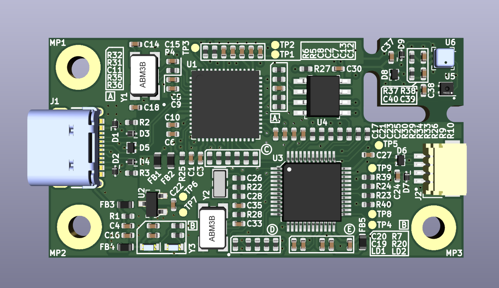

# Environment sensor board

Copyright (c) 2023 [Antmicro](https://www.antmicro.com)

## Overview

This repository contains open hardware design files for an environment sensor board with temperature, pressure and humidity sensors. 
These sensors are placed on separated island in PCB corner, which can be easily broken out from the main board, and connected to it via provided connectors with a cable.

The design files were preapared in KiCad 6.x.

## Key features
* 50.00 mm X 26.50 mm PCB SIZE
* USB-C Connector for data and power
* STM32G474CET6 host MCU
* 128kB external FRAM 
* FT4232H with MCU's JTAG UART and I2C interfaces connected
* SHT45 humidity and temperature sensor
* BME280 pressure and temperature sensor
* I2C connectors
* RTC battery backup

## Repository structure

The main repository directory contains KiCad PCB project files, a LICENSE, and a README.
The remaining files are stored in the following directories:

* `img` - contains graphics for this README

## Licensing

This project is published under the [Apache-2.0](LICENSE) license.

