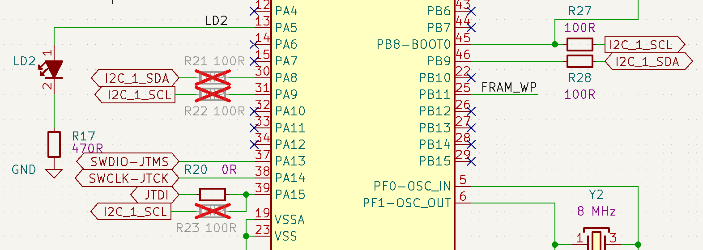

# Environment sensor board

Copyright (c) 2022-2024 [Antmicro](https://www.antmicro.com)

## Overview

This repository contains open hardware design files for an environment sensor board with temperature, pressure and humidity sensors. 

These sensors are placed on separated island in PCB corner, which can be easily broken out from the main board, and connected to it via provided connectors with a cable.

The design files were preapared in KiCad 7.x.

## Key features

* 50.00 mm X 26.50 mm PCB SIZE

* USB-C Connector for data and power

* STM32G474CET6 host MCU

* 128kB external FRAM 

* FTDI FT232r USB- UART converter

* SHT45 temperature + humidity sensor:
	* Typ. relative humidity accuracy ±1% RH
	* Operating relative humidity range 0 - 100% RH
	* Typ. temperature accuracy ±0.1 °C
	* Operating temperature range (-40) - (+125) °C
	
* BME280 temperature + humidity + pressure sensor:
	* Typ. relative humidity accuracy ±3% RH
	* Operating relative humidity range 10 - 100% RH
	* Typ. temperature accuracy ±1 °C
	* Operating temperature range (-40) - (+85) °C
	* Typ. pressure accuracy ±1 hPa
	* Operating pressure range 300 - 1100 hPa
	
* I2C connectors

* RTC battery backup

## Signal mapping

* FT232r:
	* JTAG on pins: DTR, RTS, DSR, DCD, CTS, RI (bitbang mode)
	
	* UART on pins: TXD, RXD

	* FTDI_USER_PB on CBUS0 (needs soldering R7)

		

* STM32G474CET6:
	* UART on PA2/PA3 pins
		
		
		
	* I2C on PA8/PA9/PA15(alt) or PB8/PB9(default) pins
		
		
	
	
	* FTDI_USER_PB on PC13 pin
	
	* FRAM_WP on PB11 pin

## I2C Address map (7-bit)
* FeRAM: 0x50 + A16(optional)
* SHT45: 0x44
* BME280: 0x76

## Test point assignment
* TP1 - JTAG NRST
* TP2 - JTAG TRST
* TP3 - JTAG JTMS
* TP4 - JTAG JTCK
* TP5 - JTAG TDO
* TP6 - JTAG TDI
* TP7 - FRAM Write Protect
* TP8 - MCU Boot Select
* TP9 - +3.3V power
* TP10 - GND
* TP11 - I2C SDA
* TP12 - I2C SCL 

## Repository structure

The main repository directory contains KiCad PCB project files, a LICENSE, and a README.
The remaining files are stored in the following directories:

* `img` - contains graphics for this README
* `doc` - containts board diagram

## Board diagram

## Licensing

This project is published under the [Apache-2.0](LICENSE) license.
